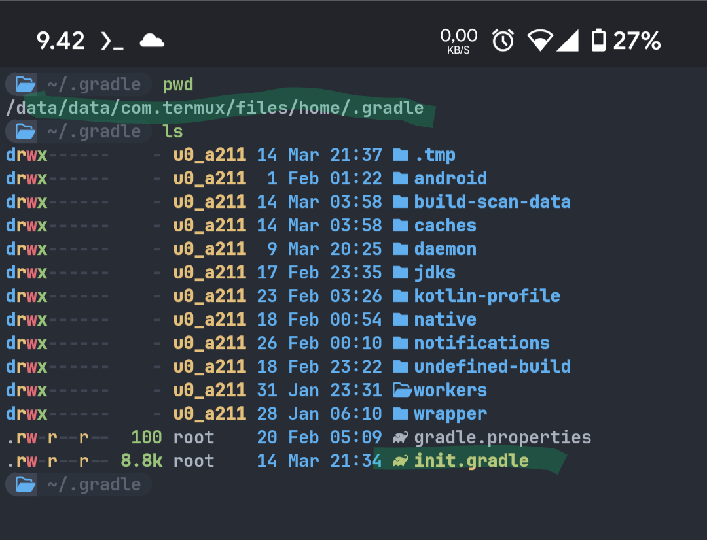
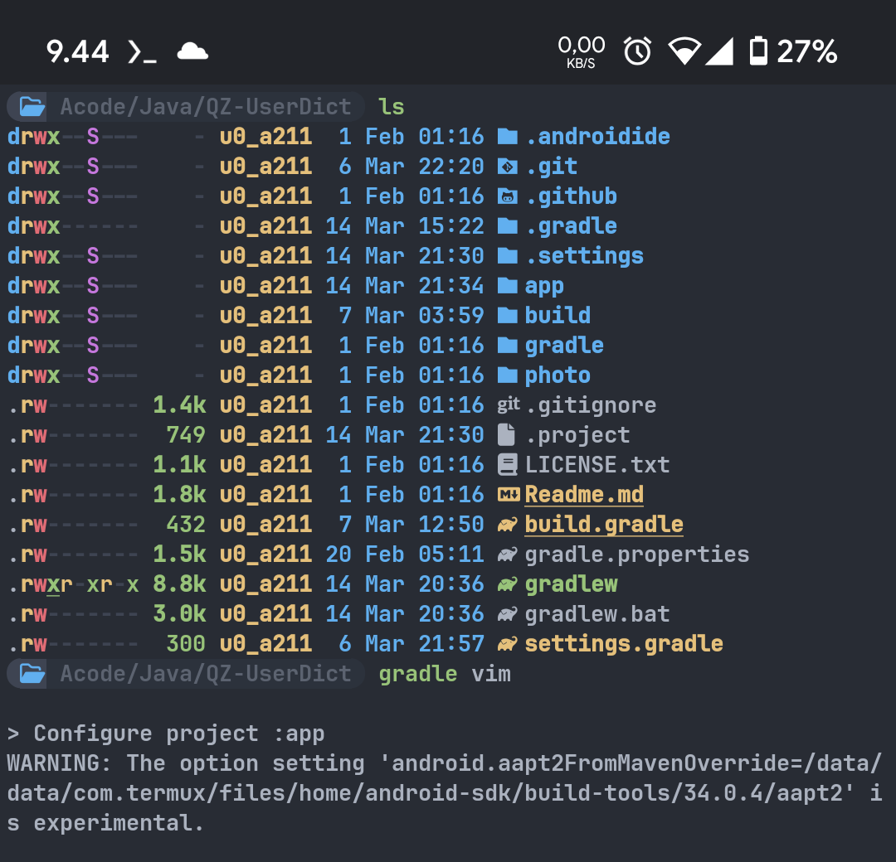
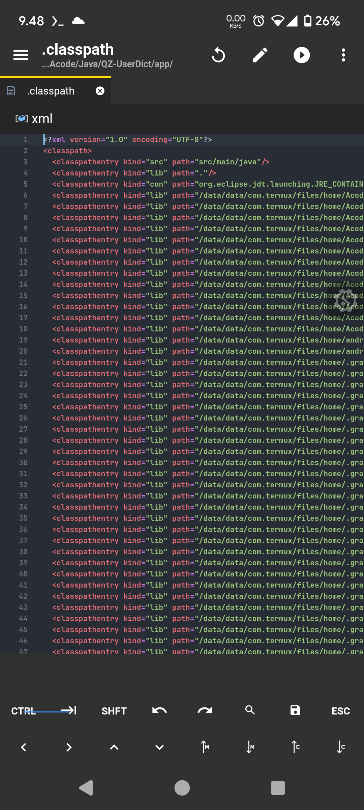
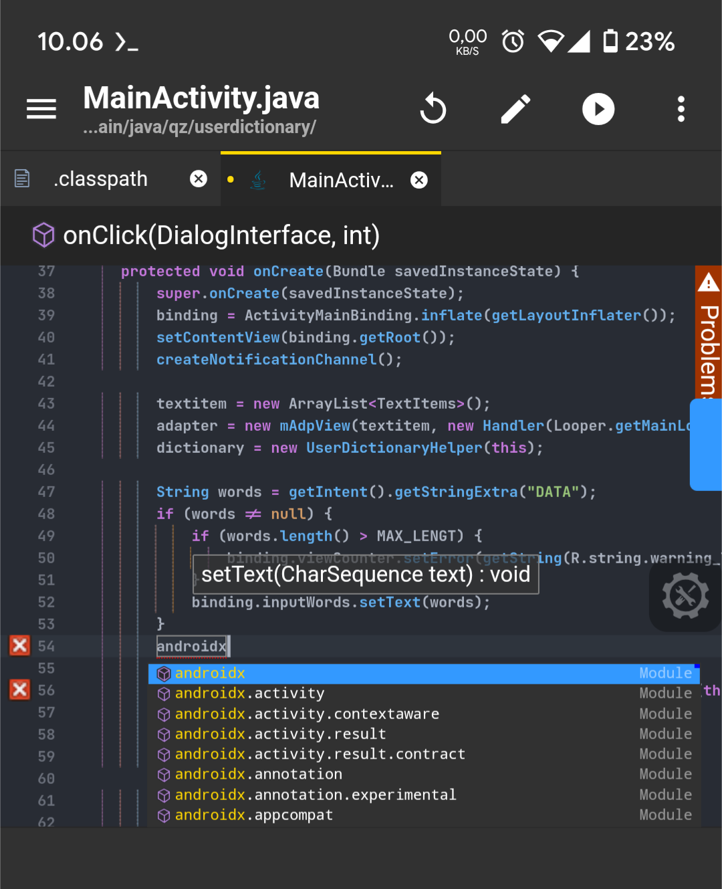

# Classpath-Generator
Classpath Generator for JDLTS Gradle Project.
This will automatically index *.jar files and then add them to the .classpath file after build or assemble Debug android project

## Tutorial

1. Insert this script in /data/data/com.termux/files/home/.gradle/
   
2. Go to your Android project folder, and call
   ```bash
      gradle vim
   ```
   
3. Open your project with JDTLS language Server
   
4. Autocomplete will be Detected
   
   
* Make sure you have built your project first before using this script,such as using commands:
  ```sh
  gradle build
  ```
  or
  ```sh
  gradle assembleDebug
  ```
  without it, *.jar will not be generated, and this script won't work either.
  
* If you are using Acode, you must close the project and close your application before executing this script.
  This is to prevent the .classpath file from being lost when jdtls is run.

  
